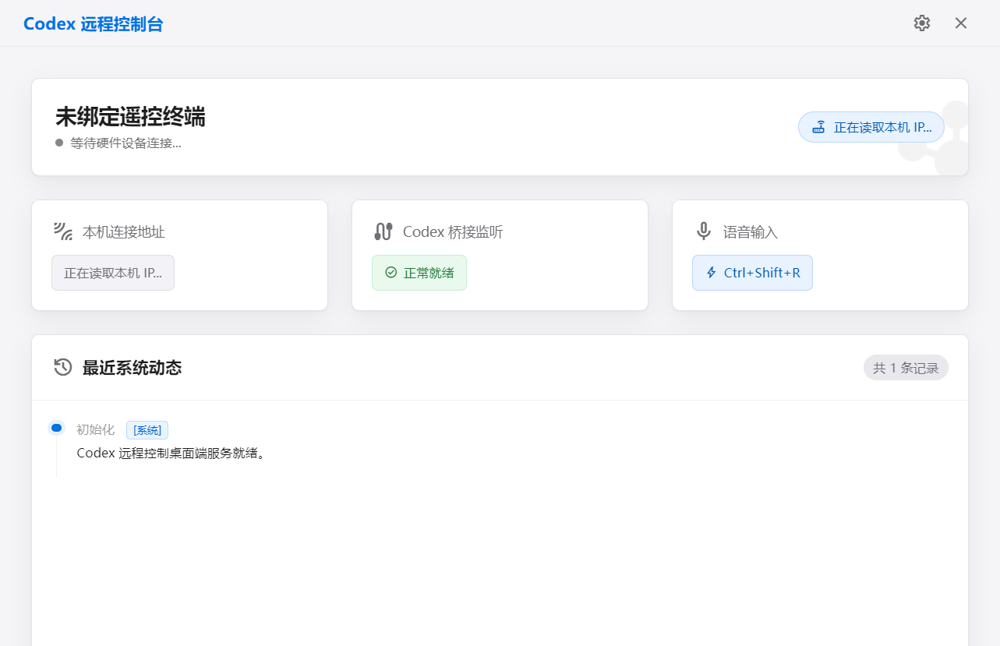

# Codex Remote

用 ESP32 远程操作电脑上的 Codex：选任务、按住说话、查看回复。

## 第一次使用

准备 Windows 11 x64、.NET 9 Runtime，并在电脑上打开已登录的 Codex。

### 1. 安装控制驱动

1. 解压 `CodexRemote-VirtualMicro-Driver-<版本号>-x64.zip`。
2. 打开 `VirtualMicroDriverInstaller.exe`，点击 **安装（覆盖安装）**，按提示完成安装。
3. 保持 EXE 和 `driver` 文件夹在一起。以后卸载也用这个程序，点击 **删除**即可。

安装时会请求管理员权限，并添加本机开发证书信任。

### 2. 连接设备

1. 打开 `CodexRemote-Portable-<版本号>.exe`。
2. 在 **基础配置**中设置 **设备认证 Token**，点击 **重启服务**。
3. 让 ESP32 和电脑连接同一个局域网。
4. 在设备上打开 **Codex → 菜单 → 连接**，选择 **局域网**，填写相同 Token，点击 **连接**。

### 3. 设置语音

**用 ESP32 麦克风说话：**

1. 从 [VB-Audio 官网](https://vb-audio.com/Cable/) 安装 VB-CABLE，按提示重启电脑。
2. PC 端打开 **语音输入**，选择 **虚拟 Codex Micro**，麦克风来源选 **ESP32 麦克风（Wi-Fi）**。
3. 点击 **刷新音频设备**，选择 **CABLE Input**，保存语音设置。
4. 在 Codex 中把麦克风选为 **CABLE Output**。
5. 回到 PC 程序，点击 **刷新驱动状态 → 检查并连接**，等待连接成功。

记住：**PC 程序选 Input，Codex 选 Output。** 控制驱动负责按键，VB-CABLE 负责声音，两者都需要安装。

**用电脑麦克风说话：**

把麦克风来源改为 **电脑麦克风**，保存并连接。在 Codex 中选择实际麦克风即可，不需要 VB-CABLE。

## 日常操作

- 在 ESP32 上选择任务，或点击 **新建任务**。
- 按住 **按住说话**，等出现 **松开发送**后讲话，说完松手。
- 不想发送时，向上滑动，看到 **松开取消**后松手。
- 查看设备或电脑上的回复；任务运行中可长按设备的 **停止**按钮约 1.2 秒。

Codex Micro 中需要绑定发送命令 **CODEX**。使用 ESP32 麦克风时对着设备讲话；使用电脑麦克风时对着电脑讲话。

## API 语音识别

在 **语音输入**中选择 **API**，填写服务地址、API Key、转写模型和语言，保存即可。配套设备的音频格式选 **裸 Opus 帧**。

当前 API 模式可以转写，但自动发送尚未接通。需要完整的“说话后发送”流程，请使用 **虚拟 Codex Micro**。

## 遇到问题

| 问题 | 先检查 |
| --- | --- |
| 设备找不到电脑 | 是否在同一局域网；防火墙是否允许 TCP 8765 和 UDP 8766 |
| 连接失败 | 两端 Token 是否一致；Codex 和 PC 程序是否已打开 |
| Micro 未连接 | 安装控制驱动，再点击“刷新驱动状态”和“检查并连接” |
| 有录音但没有文字 | 麦克风是否选对；ESP32 模式下 Codex 应选 CABLE Output |
| 有文字但没发送 | Micro 是否连接，是否绑定 CODEX 发送命令，任务是否已同步 |

开发者请看 [源码运行与打包](docs/development.md)。
